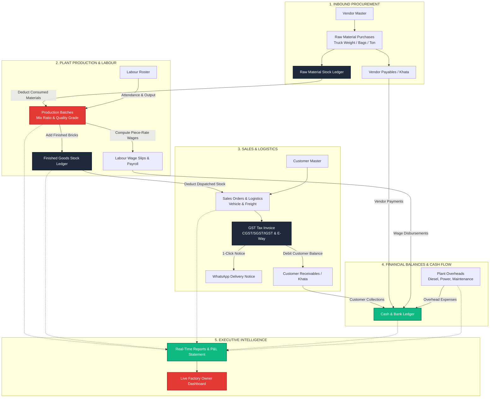

# BrickOS (BrickFlow ERP): Complete Client Presentation & Functional Specification Guide

> **The Purpose-Built Operating System for Brick, Block & Paver Manufacturing Plants**  
> *Fly Ash Bricks • Red Clay Kiln Bricks • Paver Blocks & Tiles • Concrete & Hollow Blocks*

---

## Table of Contents
1. [Executive Overview & Value Proposition](#1-executive-overview--value-proposition)
2. [End-to-End System Architecture & Data Flow](#2-end-to-end-system-architecture--data-flow)
3. [Module-by-Module Functional Deep-Dive](#3-module-by-module-functional-deep-dive)
   - [3.1 Raw Materials & Inbound Procurement](#31-raw-materials--inbound-procurement)
   - [3.2 Production Batches, Mix Ratios & Curing](#32-production-batches-mix-ratios--curing)
   - [3.3 Finished Goods Stock Ledger](#33-finished-goods-stock-ledger)
   - [3.4 Labour, Attendance & Piece-Rate Wages](#34-labour-attendance--piece-rate-wages)
   - [3.5 Customers & Receivables Khata](#35-customers--receivables-khata)
   - [3.6 Vendors & Payables Ledger](#36-vendors--payables-ledger)
   - [3.7 Sales Orders & Dispatch Logistics](#37-sales-orders--dispatch-logistics)
   - [3.8 GST Invoicing & Automated WhatsApp Dispatch](#38-gst-invoicing--automated-whatsapp-dispatch)
   - [3.9 Expenses & Plant Overheads](#39-expenses--plant-overheads)
   - [3.10 Payments & Double-Entry Cash Flow Ledger](#310-payments--double-entry-cash-flow-ledger)
   - [3.11 Financial Reports & P&L Analytics](#311-financial-reports--pl-analytics)
   - [3.12 Plant Owner Live Dashboard](#312-plant-owner-live-dashboard)
   - [3.13 Plant Configuration & Settings](#313-plant-configuration--settings)
   - [3.14 Super Admin Multi-Tenant Control Plane](#314-super-admin-multi-tenant-control-plane)
4. [The Inter-Module Connection Matrix](#4-the-inter-module-connection-matrix)
5. [A Day in the Life of a Plant: Real-World Workflow](#5-a-day-in-the-life-of-a-plant-real-world-workflow)
6. [Mathematical & Business Logic Formulas](#6-mathematical--business-logic-formulas)
7. [Client Sales Pitch & Objection Handling Script](#7-client-sales-pitch--objection-handling-script)
8. [Technical Specifications & Reliability](#8-technical-specifications--reliability)

---

## 1. Executive Overview & Value Proposition

### The Problem in Traditional Brick Manufacturing
Most brick and block manufacturing facilities in India and emerging markets operate using fragmented manual systems:
- **Raw Material Leakage**: Cement and fly ash bags are received on loose weight-bridge slips; pilferage and incorrect mixing ratios go undetected.
- **Labour Disputes**: Piece-rate wages (paid per 1,000 bricks moulded or loaded) and cash advances (*kharchi*) lead to frequent disputes at the end of the week.
- **Uncontrolled Credit (*Udhaar*)**: Sales to contractors and builders are recorded in physical paper registers; owners lose track of aged receivables, creating severe working capital crunches.
- **Generic Software Failure**: Traditional accounting packages (like generic Tally or Excel) do not understand manufacturing realities: batch mix ratios, kiln curing stages, vehicle tare weights, or piece-rate labor formulas.

### The BrickOS Solution
**BrickOS** is an integrated, vertical SaaS ERP designed specifically for the industrial brick manufacturing ecosystem. It synchronizes the entire operation:
1. **Tracks inputs** (Truck loads of cement, fly ash, stone dust, sand).
2. **Monitors production** (Batch mix ratios, machine lines, curing chambers, scrap and breakage rates).
3. **Automates labor payroll** (Daily attendance + automated piece-rate wages calculated per 1,000 bricks).
4. **Controls yard inventory** (Real-time stock ledger of A-Grade, B-Grade, and scrap products).
5. **Streamlines sales & delivery** (Orders, delivery truck details, driver info, freight handling).
6. **Delivers compliant billing** (GST tax invoices with instant WhatsApp sharing to buyers).
7. **Maintains complete cash flow** (Receivables aging, vendor payables, diesel/power overheads, and live P&L).

---

## 2. End-to-End System Architecture & Data Flow

Every event in BrickOS triggers automatic downstream updates across inventory, payroll, khata ledgers, and financial reports:



---

## 3. Module-by-Module Functional Deep-Dive

---

### 3.1 Raw Materials & Inbound Procurement
- **Primary Purpose**: Controls the entry of all industrial bulk inputs required for manufacturing (Grade 53 OPC Cement, Thermal Fly Ash, Crushed Stone Dust, River Sand, Gypsum, Chemical Hardeners, Pigments).
- **Core Operations**:
  - Inward truck purchase entry: Vehicle number, driver phone, vendor selection, gross weight, tare weight, net weight, or bag counts.
  - Cost tracking: Unit rate per Ton/Bag, total bill amount, freight charges, and payment mode (Cash, UPI, NEFT, Credit).
  - Minimum safety threshold alerts for critical materials.
- **Inter-Module Connectivity**:
  - **Fed by**: Vendor Master.
  - **Feeds**: 
    - **Raw Material Stock**: Immediately increases physical on-hand stock and recalculates moving weighted average cost.
    - **Vendor Khata**: If unpaid or partially paid, creates an outstanding liability in the vendor ledger.
    - **Plant Dashboard**: Updates total inventory asset valuation.

---

### 3.2 Production Batches, Mix Ratios & Curing
- **Primary Purpose**: Tracks daily manufacturing across machine lines, curing yards, and firing kilns.
- **Core Operations**:
  - Machine lines supported: Automatic Hydraulic Press Line 1, Semi-Automatic Line 2, Manual Yard.
  - Batch code generation (e.g., `BAT-2026-8412`).
  - Standard recipe & mix proportion definitions (e.g., *1 Part Cement : 5 Parts Fly Ash : 3 Parts Stone Dust*).
  - Output recording: Target quantity, actual quantity produced, damaged/breakage units.
  - Quality sorting: `A-Grade`, `B-Grade`, `Commercial`, `Scrap`.
  - Lifecycle state management: `Draft` ➔ `In Progress` ➔ `Curing / Firing` ➔ `Completed`.
- **Inter-Module Connectivity**:
  - **Inputs from**: Raw Material Stock (checks material availability).
  - **Feeds**:
    - **Raw Material Stock**: Automatically debits the exact quantities consumed in the batch.
    - **Finished Goods Stock**: Automatically credits verified good bricks to the yard stock ledger.
    - **Labour Module**: Feeds piece-rate worker output counts to calculate daily wages.
    - **Cost Reports**: Calculates the actual manufacturing cost per brick.

---

### 3.3 Finished Goods Stock Ledger
- **Primary Purpose**: An auditable inventory ledger maintaining real-time balances for all finished brick products.
- **Core Operations**:
  - Supported SKUs: Fly Ash Bricks (9x4x3), Red Clay Kiln Bricks, Zig-Zag Bricks, Paver Blocks (I-Shape, Zig-zag, 60mm/80mm), Hollow Concrete Blocks, Solid Blocks.
  - Transaction types: `Production In (+)` , `Sales Dispatch Out (-)`, `Breakage Adjustment (-)`, `Customer Return (+)`.
  - Real-time stock status: Current physical balance, reserved balance, and reorder alerts.
- **Inter-Module Connectivity**:
  - **Fed by**: Production Batches (inward stock).
  - **Deducted by**: Sales Order dispatches (outward stock).
  - **Feeds**: Executive Dashboard (alerts plant owner when yard stock falls below dispatch commitments).

---

### 3.4 Labour, Attendance & Piece-Rate Wages
- **Primary Purpose**: Eliminates payroll friction and dispute in plants employing both monthly/daily staff and piece-rate migrant labor.
- **Core Operations**:
  - Worker directory: Machine Operators, Kiln Workers, Mould Workers, Loaders/Stackers, Supervisors, Drivers, Helpers.
  - Dual wage system support:
    1. **Fixed Daily Wage**: Fixed rate per day (e.g., ₹750/day) with hourly overtime calculation.
    2. **Piece-Rate Wage**: Paid strictly per 1,000 bricks made, stacked, or loaded (e.g., ₹650 per 1,000 bricks).
  - Daily attendance register: `Present`, `Absent`, `Half-Day`, `Leave`.
  - Advance deduction tracking (*Kharchi* given during the week).
  - Automated weekly/monthly wage slip generation with cash/UPI payout receipts.
- **Inter-Module Connectivity**:
  - **Inputs from**: Production Batches (validates piece-rate counts against real output).
  - **Feeds**:
    - **Payments Module**: Creates wage payout disbursements.
    - **P&L Statement**: Supplies labor overhead costs.

---

### 3.5 Customers & Receivables Khata
- **Primary Purpose**: Tracks client profiles, credit terms, and balances for building contractors, developers, government contractors, and retail buyers.
- **Core Operations**:
  - Customer directory with GSTIN, billing address, site delivery locations, and credit limits.
  - Complete digital Khata ledger: Opening balance, invoices billed, payments collected, and live outstanding debt.
  - Aging classification: `0–15 Days (Current)`, `16–30 Days (Due)`, `31+ Days (Overdue)`.
- **Inter-Module Connectivity**:
  - **Feeds**: Sales Orders (enforces credit limits before allowing truck dispatch).
  - **Fed by**: Sales Invoices (debits account) and Customer Payments (credits account).
  - **Feeds**: Financial Aging Reports on the dashboard.

---

### 3.6 Vendors & Payables Ledger
- **Primary Purpose**: Manages suppliers of cement, fly ash, quarry stone dust, sand, fuel, and equipment parts.
- **Core Operations**:
  - Vendor profiles, contact details, GSTIN, and materials supplied.
  - Running payable ledger: Total purchases made, amounts paid, and pending balances.
- **Inter-Module Connectivity**:
  - **Fed by**: Raw Material Purchases.
  - **Deducted by**: Vendor Payments in the Payments module.
  - **Feeds**: Cash Flow forecasts and Payables on the owner dashboard.

---

### 3.7 Sales Orders & Dispatch Logistics
- **Primary Purpose**: Manages the order booking and delivery dispatch pipeline.
- **Core Operations**:
  - Order entry: Product selection, quantity, agreed unit rate, discount, and tax rate.
  - Vehicle dispatch recording: Delivery vehicle number (e.g., `MH-12-AB-1234`), driver name, driver mobile number, destination site address.
  - Freight handling: Tracks whether transportation is paid by the factory or the customer.
- **Inter-Module Connectivity**:
  - **Checks**: Finished Goods Stock (verifies yard availability before dispatch).
  - **Feeds**:
    - **Finished Goods Stock**: Instantly deducts dispatched quantity upon gate exit.
    - **GST Invoicing**: Automatically triggers invoice generation with matching dispatch data.
    - **Customer Khata**: Posts the order amount to customer's account balance.

---

### 3.8 GST Invoicing & Automated WhatsApp Dispatch
- **Primary Purpose**: Eliminates manual bill writing and sends verified tax invoices directly to clients.
- **Core Operations**:
  - Full GST compliance: CGST, SGST, IGST calculations based on intra-state or inter-state sales.
  - HSN code support (e.g., `6815` for Fly Ash Bricks, `6901` for Clay Bricks, `6810` for Concrete Pavers).
  - Print & PDF layout formatted with factory branding, bank details, and dynamic UPI QR code for scanning.
  - **One-Click WhatsApp Dispatch**: Directly sends a pre-formatted message with invoice number, date, truck number, and amount due to the customer's WhatsApp.
- **Inter-Module Connectivity**:
  - **Fed by**: Sales Orders & Factory Profile Settings.
  - **Feeds**: Customer Receivables ledger and Payments module.

---

### 3.9 Expenses & Plant Overheads
- **Primary Purpose**: Records all secondary operational expenses to ensure accurate net profit calculations.
- **Core Operations**:
  - Expense categories: Diesel (Generators, Loaders, Forklifts), Electricity Bills, Machine Maintenance & Spares, Vehicle Repairs, Kiln Fuel (Coal, Biomass, Wood), Food/Mess Expenses, Office Supplies.
  - Payment modes: Cash drawer, UPI, Bank transfer, Cheque.
- **Inter-Module Connectivity**:
  - **Feeds**:
    - **Cash & Bank Ledger**: Deducts funds from cash or bank accounts.
    - **P&L Statement**: Feeds operational expense line items into net profit calculations.

---

### 3.10 Payments & Double-Entry Cash Flow Ledger
- **Primary Purpose**: Unified double-entry ledger managing all monetary inflows and outflows.
- **Core Operations**:
  - **Inflows**: Customer invoice receipts, advances, miscellaneous income.
  - **Outflows**: Vendor payments, labour wage disbursements, daily plant expenses.
  - Payment modes supported: Cash, UPI, NEFT/RTGS, Cheque.
- **Inter-Module Connectivity**:
  - **Synchronizes with**: Customer Khata, Vendor Khata, Labour Wage Slips, and Cash-on-Hand records.

---

### 3.11 Financial Reports & P&L Analytics
- **Primary Purpose**: Delivers automated business intelligence without needing an external accountant.
- **Core Operations**:
  - **Monthly Profit & Loss Statement**:
    $$\text{Net Margin} = \text{Sales Revenue} - (\text{Raw Material Cost} + \text{Labour Wages} + \text{Overhead Expenses})$$
  - **Customer Aging Analysis**: Tracks receivables aging to reduce bad debts.
  - **Unit Production Cost Breakdown**: Computes exact cost to produce one brick.
  - **Inventory Valuation**: Current asset value of raw material warehouse and finished brick yards.

---

### 3.12 Plant Owner Live Dashboard
- **Primary Purpose**: Executive cockpit providing complete operational visibility at a glance.
- **Core Operations**:
  - Real-time KPIs: Today's Production, Monthly Production, Today's Sales, Stock Valuation, Customer Receivables, Vendor Payables, Active Workers on Site.
  - Production trend graphs across product lines.
  - Low-stock warning banners.
  - Instant time-period toggling (`Today`, `Yesterday`, `This Week`, `This Month`, `Last Month`).

---

### 3.13 Plant Configuration & Settings
- **Primary Purpose**: Manages factory legal details, banking setup, and system security.
- **Core Operations**:
  - Factory profile: Trade name, factory code, owner name, address, GSTIN.
  - Banking details for invoices: Bank name, account number, IFSC code, branch, UPI ID.
  - Tamper-evident system audit log: Records user logins, batch edits, stock adjustments, and invoice cancellations.

---

### 3.14 Super Admin Multi-Tenant Control Plane
- **Primary Purpose**: SaaS control plane for platform operators managing multiple factory subscriptions.
- **Core Operations**:
  - Multi-tenant directory: View, activate, suspend, or provision new factory instances.
  - SaaS subscription billing & MRR tracking.
  - Demo sandbox controls: 1-click database reset and synthetic data generation for client demonstrations.
  - Persona switching: Switch between Super Admin and Factory Owner personas with one click.

---

## 4. The Inter-Module Connection Matrix

This matrix demonstrates how actions in any module cascade across the entire ERP:

| # | Action Initiated in Module | Modules Directly Impacted | Exact Operational Change |
| :---: | :--- | :--- | :--- |
| **1** | **Raw Material Inward**<br>*(Truck arrives with 20T Cement)* | • Raw Materials<br>• Vendors<br>• Dashboard | • Cement stock increases by 20 Tons.<br>• Average unit cost per ton recalculates.<br>• Vendor balance increases by bill total.<br>• Plant asset valuation rises on Dashboard. |
| **2** | **Complete Production Batch**<br>*(15,000 Fly Ash Bricks made)* | • Raw Materials<br>• Production<br>• Finished Stock<br>• Labour Payroll<br>• Dashboard | • 42 bags cement & 9.5T fly ash deducted from stock.<br>• 14,850 A-Grade bricks added to yard inventory.<br>• 150 scrap bricks logged to damage register.<br>• Piece-rate moulders credited with earned wages.<br>• Today's production counter increments. |
| **3** | **Book & Dispatch Sales Order**<br>*(8,000 Bricks loaded on truck)* | • Finished Stock<br>• Sales Orders<br>• Invoices<br>• Customers<br>• Logistics | • Finished goods stock decrements by 8,000 units.<br>• Truck & driver info attached to dispatch record.<br>• GST tax invoice generated automatically.<br>• Customer Khata debited with invoice amount.<br>• WhatsApp delivery message prepared. |
| **4** | **Record Customer Payment**<br>*(₹50,000 received via UPI)* | • Payments<br>• Customers<br>• Invoices<br>• Dashboard | • Customer outstanding debt decreases by ₹50,000.<br>• Targeted invoice marked `Paid` or `Partial`.<br>• Factory bank balance increments.<br>• Cash flow collection KPIs update in real-time. |
| **5** | **Mark Labour Attendance**<br>*(Shift starts at 8:00 AM)* | • Labour<br>• Production<br>• Payroll | • Logs presence of machine operators and moulders.<br>• Enables wage calculations for active workers.<br>• Flags absent key personnel (e.g. crane driver). |
| **6** | **Disburse Weekly Wages**<br>*(Cash advance/wage payment)* | • Labour<br>• Payments<br>• Reports (P&L) | • Wage slip marked as `Paid`.<br>• Factory cash drawer balance reduced.<br>• Labor cost posted to Monthly P&L statement. |
| **7** | **Log Diesel Tanker Purchase**<br>*(₹18,000 for plant generator)* | • Expenses<br>• Payments<br>• Reports (P&L) | • Diesel expense logged under plant overheads.<br>• Cash/bank balance debited.<br>• Operating expense reflected in net margin calculations. |

---

## 5. A Day in the Life of a Plant: Real-World Workflow

Here is how a typical manufacturing day runs smoothly on BrickOS:

```
08:00 AM ── [LABOUR & ATTENDANCE]
            Supervisor opens BrickOS on a phone or tablet.
            Marks 14 workers present. Daily wage and piece-rate rosters locked in 90 seconds.

09:30 AM ── [RAW MATERIAL INWARD]
            Fly ash tanker and cement truck arrive at the weighbridge.
            Supervisor logs truck number, vendor, and net weight.
            Stock updates; vendor balance credited; no paper slips lost.

01:00 PM ── [PRODUCTION BATCH COMPLETION - SHIFT 1]
            Hydraulic Press Line 1 finishes morning cycle.
            Supervisor logs: 15,000 Fly Ash Bricks produced (14,850 A-Grade, 150 scrap).
            BrickOS automatically deducts 42 bags cement & 9.5T fly ash from stock.
            14,850 bricks added to yard inventory; moulders' piece-rate wages credited.

03:30 PM ── [SALES ORDER & DISPATCH]
            A builder calls ordering 8,000 bricks for immediate site delivery.
            Sales desk checks yard inventory (verified 48,000 on hand).
            Order booked, truck number MH-12-Q-4521 assigned.
            System auto-deducts 8,000 bricks from stock and generates GST tax invoice.

04:00 PM ── [AUTOMATED WHATSAPP BILLING]
            Driver departs gate.
            Sales manager clicks "Share WhatsApp".
            Builder receives instant WhatsApp message with tax invoice, rate, truck number,
            and factory UPI QR code for payment.

05:30 PM ── [EXPENSE LOGGING]
            Plant generator diesel refilled. Accountant logs ₹4,500 under "Expenses: Diesel".
            Cash balance updates.

06:30 PM ── [OWNER EXECUTIVE REVIEW]
            Factory owner opens BrickOS Dashboard from home or office.
            Sees:
            • Today's Output: 31,450 Bricks (across 2 shifts)
            • Today's Dispatches: 24,000 Bricks (₹1,56,000)
            • Today's Cash Inflow: ₹85,000 collected
            • Current Receivables: ₹4,12,000
            • Net Daily Operating Margin calculated automatically.
```

---

## 6. Mathematical & Business Logic Formulas

BrickOS automates the core math of the brick business:

### 1. Piece-Rate Wage Calculation
$$\text{Worker Daily Earnings} = \left(\frac{\text{Units Moulded / Loaded}}{1,000}\right) \times \text{Agreed Piece Rate} + (\text{Overtime Hours} \times \text{Hourly OT Rate})$$

### 2. Net Wage Payable at End of Week
$$\text{Net Payable} = \text{Base Wage} + \text{Piece Rate Earnings} + \text{OT} - (\text{Weekly Advances [Kharchi]} + \text{Deductions})$$

### 3. Unit Production Cost per Brick
$$\text{Cost per Brick} = \frac{\text{Raw Materials Consumed} + \text{Labour Wages} + \text{Power/Fuel Allocated}}{\text{Total Usable Bricks Produced}}$$

### 4. Plant Net Operating Margin
$$\text{Net Profit} = \text{Total Invoiced Revenue} - (\text{Raw Material Costs} + \text{Labour Costs} + \text{Overhead Expenses})$$

---

## 7. Client Sales Pitch & Objection Handling Script

Use these proven points when demonstrating BrickOS to plant owners:

### Objection 1: "My staff is not tech-savvy; they cannot use complex computers."
> **Response**: *"BrickOS was designed specifically for Indian factory conditions. Large touch-friendly buttons, simple dropdowns, and mobile-friendly screens allow any supervisor who can use WhatsApp to master attendance, production, and truck dispatch in less than 15 minutes."*

### Objection 2: "We already have Tally."
> **Response**: *"Tally is an accounting ledger for your tax consultant at year-end; it does not run your factory yard. Tally cannot track mix proportions, check how many bricks broke in curing, calculate piece-rate wages per 1,000 bricks, or generate a delivery gate pass for a truck driver. BrickOS manages your daily operations, and you can export clean totals to your accountant whenever needed."*

### Objection 3: "How does BrickOS increase my profit?"
> **Response**: *"BrickOS pays for itself in the first 30 days through three direct leak-stoppers:*
> 1. *Stops raw material theft and over-mixing (saving 4% to 7% on cement and fly ash).*
> 2. *Stops ghost workers and inaccurate piece-rate labor counts.*
> 3. *Reduces uncollected customer debts through automated WhatsApp billing and aging alerts."*

---

## 8. Technical Specifications & Reliability

- **Frontend**: High-speed Single Page Application built with React 19, TypeScript, and Tailwind CSS v4.
- **Data Safety & Cloud Architecture**: Multi-tenant architecture running on Supabase PostgreSQL with automated daily backups and Row-Level Security (RLS) ensuring strict isolation between factories.
- **Offline & Low-Bandwidth Resilience**: LocalStorage mock engine allows instant offline testing, training, and rapid screen rendering even in remote industrial areas with poor connectivity.
- **Zero Installation Required**: Runs smoothly in any web browser on smartphones (Android/iOS), tablets, laptops, and desktop computers.

---

*(End of Guide — Prepared for Client Demonstrations and Technical Appraisals)*
